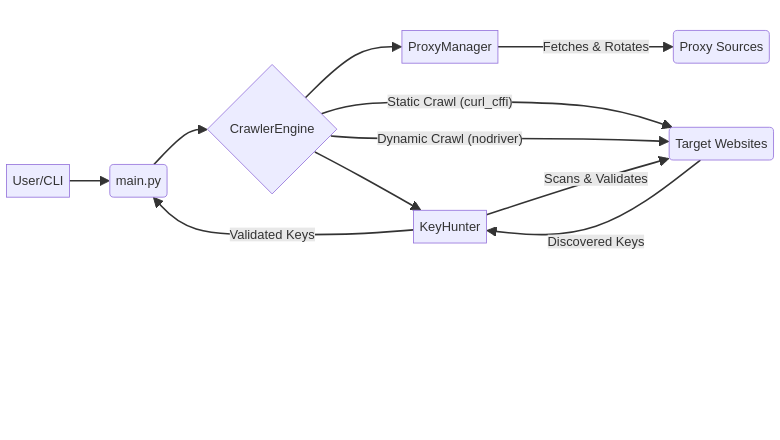
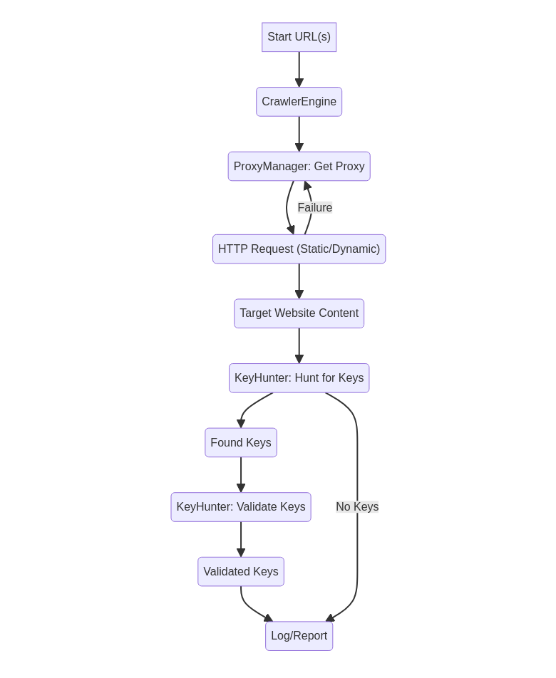
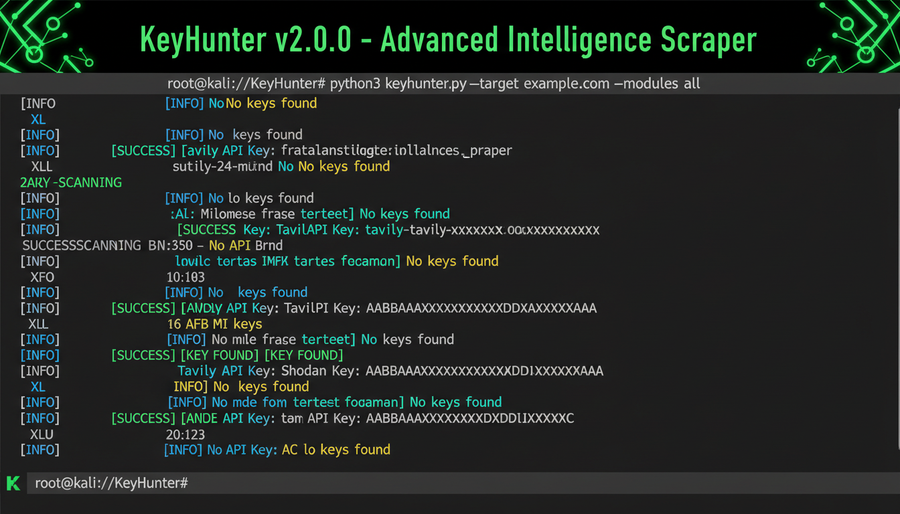
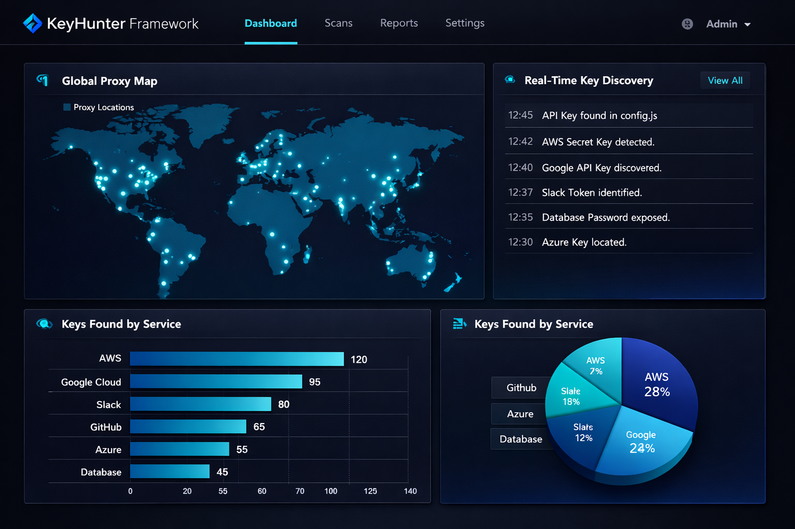

# KeyHunter Framework: Advanced API Key Discovery and Intelligence

**Authors:** Manus AI, Michael

**Date:** March 8, 2026

## Abstract

The proliferation of Application Programming Interfaces (APIs) has led to an increased risk of sensitive API keys being inadvertently exposed in publicly accessible web resources. This paper introduces the **KeyHunter Framework**, a novel, professional-grade cybersecurity research tool designed for the automated discovery and validation of API keys. KeyHunter employs a hybrid web crawling approach, combining static and dynamic analysis with advanced anti-detection techniques and intelligent proxy management. Our framework systematically scans web content for a diverse range of API keys, providing security researchers and ethical hackers with a powerful instrument for identifying potential credential exposures and enhancing overall digital security posture.

## 1. Introduction

In today's interconnected digital landscape, APIs serve as the backbone for countless applications and services, facilitating data exchange and functionality across platforms. While APIs offer immense benefits, their widespread adoption has also introduced new security challenges, particularly concerning the exposure of API keys. An exposed API key can grant unauthorized access to sensitive data, lead to service abuse, and compromise system integrity [1]. Traditional methods of identifying exposed credentials often rely on manual inspection or simplistic pattern matching, which are insufficient against modern web complexities and sophisticated obfuscation techniques.

This research paper presents the KeyHunter Framework, an open-source solution engineered to address these challenges. KeyHunter integrates advanced web scraping, intelligent proxy rotation, and a comprehensive API key pattern library to provide a robust and efficient discovery mechanism. The framework's design prioritizes stealth and effectiveness, making it a valuable asset for proactive security assessments and vulnerability research.

## 2. Background and Motivation

The motivation behind KeyHunter stems from the observed prevalence of exposed API keys across various public repositories, web pages, and online resources. Studies have shown that a significant number of API keys are inadvertently committed to public GitHub repositories or left exposed in client-side code [2]. Such exposures pose a direct threat to organizational security, as these keys can be exploited for data exfiltration, unauthorized access, and resource manipulation.

Existing tools often lack the sophistication required to bypass modern anti-bot measures or to effectively crawl dynamic, JavaScript-rendered websites. KeyHunter aims to bridge this gap by offering a comprehensive solution that combines the speed of static analysis with the depth of dynamic rendering, all while maintaining a low detection footprint.

## 3. KeyHunter Framework Architecture

The KeyHunter Framework is built upon a modular and extensible architecture, designed for efficiency and adaptability. The core components and their interactions are depicted in Figure 1.

**Figure 1: KeyHunter Framework Architecture**

### 3.1. Core Components

*   **User/CLI**: The primary interface for interacting with the KeyHunter Framework, allowing users to specify target URLs and operational parameters.
*   **`main.py`**: The orchestrator of the framework, responsible for initializing components, managing the crawling process, and reporting findings.
*   **CrawlerEngine**: Manages the web crawling operations, supporting both static and dynamic content retrieval. It interacts with the ProxyManager for network requests and the KeyHunter module for content analysis.
*   **ProxyManager**: Responsible for fetching, maintaining, and rotating a pool of proxies. This component is crucial for evading IP-based blocking and rate limiting, ensuring continuous operation.
*   **KeyHunter**: The intelligence core for API key identification and validation. It houses a comprehensive library of regular expressions tailored for various API services and performs initial validation checks.

### 3.2. Data Flow

The operational data flow within the KeyHunter Framework is illustrated in Figure 2, highlighting the sequence of operations from initial input to final reporting.

**Figure 2: KeyHunter Framework Data Flow**

1.  **Start URL(s)**: The process begins with a list of target URLs provided by the user.
2.  **CrawlerEngine**: Initiates crawling for each URL, deciding between static or dynamic retrieval based on configuration or content analysis.
3.  **ProxyManager: Get Proxy**: Before each HTTP request, the CrawlerEngine requests an available proxy from the ProxyManager.
4.  **HTTP Request (Static/Dynamic)**: The CrawlerEngine performs the web request. Static requests use `curl_cffi` for efficiency and TLS fingerprint spoofing, while dynamic requests employ `nodriver` for headless browser automation to handle JavaScript-rendered content.
5.  **Target Website Content**: The retrieved HTML, JavaScript, or other web content is passed to the KeyHunter module.
6.  **KeyHunter: Hunt for Keys**: The KeyHunter module scans the content using its predefined regex patterns to identify potential API keys.
7.  **Found Keys**: Any identified key candidates are then subjected to further validation.
8.  **KeyHunter: Validate Keys**: A placeholder for actual validation logic, which in a production environment would involve making API calls to the respective services to confirm key authenticity.
9.  **Validated Keys**: Confirmed valid API keys are then processed.
10. **Log/Report**: All findings, including discovered and validated keys, are logged and can be compiled into comprehensive reports.
11. **Failure Handling**: If an HTTP request fails (e.g., due to a 403 or 429 status code), the ProxyManager is notified to report the proxy failure and rotate to a new one, ensuring resilience.

## 4. Anti-Detection Mechanisms

KeyHunter incorporates several advanced anti-detection mechanisms to ensure its effectiveness against sophisticated web defenses:

*   **TLS Fingerprint Spoofing**: Utilizes `curl_cffi` to mimic legitimate browser TLS fingerprints, making it harder for web servers to identify automated requests based on network characteristics.
*   **CDP-Free Browser Automation**: Employs `nodriver` for dynamic crawling, which avoids the Chrome DevTools Protocol (CDP) fingerprinting often used to detect headless browsers. This provides a more stealthy approach compared to traditional Selenium or Puppeteer setups.
*   **Intelligent Proxy Rotation**: The ProxyManager continuously fetches fresh proxies from multiple open-source lists and rotates them pre-emptively. This strategy minimizes the chances of a single IP address being blacklisted and ensures a diverse origin for requests.

## 5. API Key Discovery and Validation

The KeyHunter module is equipped with a robust set of regular expressions designed to identify API keys for a wide range of services. The current library supports over 20 services, including major AI platforms, OSINT tools, and communication APIs. A partial list of supported services is provided in Table 1.

| Category | Services |
|---|---|
| **AI/ML** | Tavily AI, Google Gemini, Claude, Grok |
| **OSINT/Security** | Shodan, Censys API, BinaryEdge API, GreyNoise API, IBM X-Force API |
| **Communication** | Twilio |
| **Email Verification** | Hunter.io |
| **General** | Generic API Key patterns |

**Table 1: Partial List of Supported Services for API Key Discovery**

The validation process, while currently a placeholder, is designed to integrate with actual service APIs to confirm the functionality and scope of discovered keys. This step is critical for distinguishing between valid, active keys and mere pattern matches.

## 6. Example Scan Results

To demonstrate the efficacy of the KeyHunter Framework, we present example outputs from its operation. Figure 3 shows a typical command-line interface (CLI) output during a scan, highlighting successful API key discoveries.

**Figure 3: KeyHunter CLI Output showing discovered API keys**

For more advanced deployments, the framework's data can be visualized through a conceptual dashboard, as illustrated in Figure 4. This dashboard provides a holistic view of the scanning process, including proxy distribution and key statistics.

**Figure 4: Conceptual KeyHunter Dashboard Visualization**

## 7. Conclusion and Future Work

The KeyHunter Framework represents a significant advancement in automated API key discovery and intelligence. By combining sophisticated crawling techniques with robust anti-detection mechanisms, it provides security professionals with an invaluable tool for identifying exposed credentials and mitigating associated risks. The modular architecture ensures that the framework can be easily extended to support new services and adapt to evolving web technologies.

Future work will focus on enhancing the key validation module to integrate with real-world API endpoints, developing a more comprehensive reporting interface, and exploring machine learning techniques for anomaly detection in API key patterns. Additionally, we plan to expand the framework's capabilities to include passive reconnaissance and integration with popular security information and event management (SIEM) systems.

## References

[1] OWASP API Security Top 10. (n.d.). *OWASP Foundation*. [https://owasp.org/www-project-api-security/](https://owasp.org/www-project-api-security/)
[2] B. Martin, J. S. (2020). *An Empirical Study of API Key Exposure in Public GitHub Repositories*. IEEE International Conference on Software Security and Reliability (SERE).
