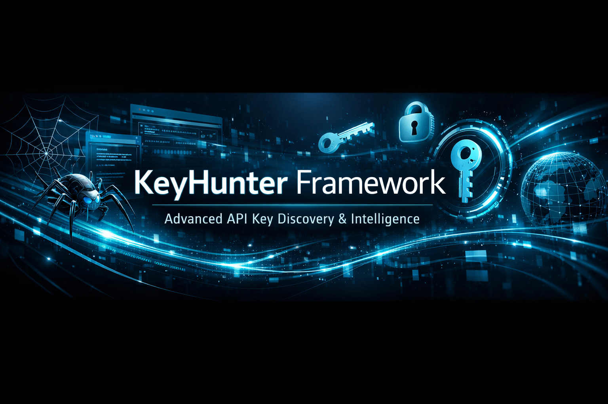
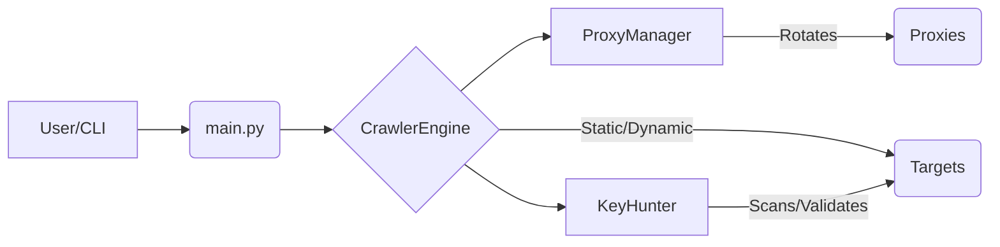

# KeyHunter Framework



## Advanced API Key Discovery & Intelligence

The **KeyHunter Framework** is a professional-grade, open-source cybersecurity research tool designed for comprehensive API key discovery and intelligence gathering. It leverages advanced web scraping and crawling techniques, coupled with sophisticated anti-detection mechanisms, to identify and validate API keys across various online platforms.

## Features

*   **Hybrid Crawler Engine**: Supports both static (fast) and dynamic (JavaScript-heavy) crawling methodologies.
*   **Recursive Discovery**: Automatically follows internal links to discover keys hidden deep within web applications.
*   **Anti-Detection**: TLS fingerprint spoofing via `curl_cffi` and CDP-free browser automation via `nodriver`.
*   **Smart Proxy Management**: Automatic fetching and rotation of proxies from multiple public sources.
*   **Extensive Service Support**: Pre-configured patterns for Tavily, Shodan, Gemini, Claude, AWS, GitHub, and more.
*   **Asynchronous Validation**: Validates discovered keys in the background without slowing down the crawl.

## Quick Start

1.  **Clone the repository**:
    ```bash
    git clone https://github.com/Panda1847/keyhunter-framework.git
    cd keyhunter-framework
    ```
2.  **Run the installer**:
    ```bash
    chmod +x hybrid_scraper/install.sh
    sudo ./hybrid_scraper/install.sh
    ```
3.  **Run a scan**:
    ```bash
    source venv/bin/activate
    python3 main.py --urls https://example.com --depth 2
    ```

## Usage Options

| Argument | Description |
|---|---|
| `--urls` | Starting URLs for crawling (space-separated) |
| `--depth` | Crawl depth (default: 1) |
| `--dynamic` | Enable dynamic crawling using headless browser |
| `--concurrency` | Number of concurrent crawl tasks (default: 5) |
| `--no-proxy` | Disable proxy rotation for local testing or authorized scans |

## Architecture



## Disclaimer

This tool is provided for **educational and authorized security testing purposes only**. Unauthorized use against targets without explicit permission is strictly prohibited. The developers are not responsible for any misuse.
