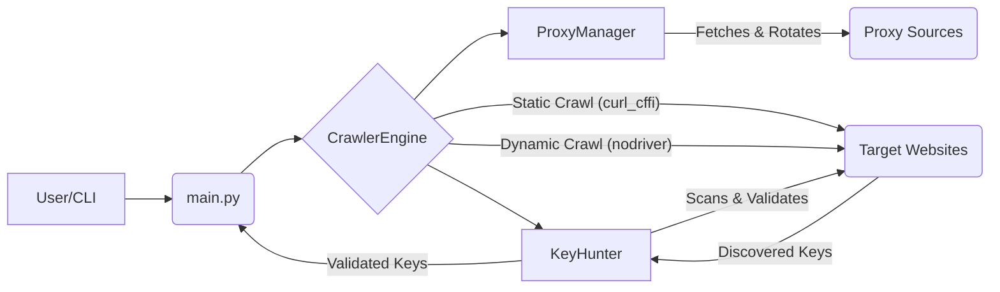

```mermaid
graph LR
    A[User/CLI] --> B(main.py)
    B --> C{CrawlerEngine}
    C --> D[ProxyManager]
    C --> E[KeyHunter]
    D -- Fetches & Rotates --> F(Proxy Sources)
    C -- Static Crawl (curl_cffi) --> G(Target Websites)
    C -- Dynamic Crawl (nodriver) --> G
    E -- Scans & Validates --> G
    G -- Discovered Keys --> E
    E -- Validated Keys --> B
```
