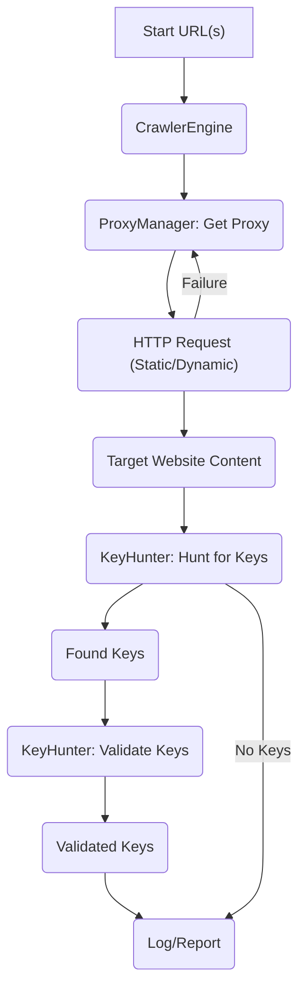

```mermaid
graph TD
    A["Start URL(s)"] --> B(CrawlerEngine)
    B --> C("ProxyManager: Get Proxy")
    C --> D("HTTP Request (Static/Dynamic)")
    D --> E(Target Website Content)
    E --> F("KeyHunter: Hunt for Keys")
    F --> G(Found Keys)
    G --> H("KeyHunter: Validate Keys")
    H --> I(Validated Keys)
    I --> J(Log/Report)
    F -- No Keys --> J
    D -- Failure --> C
```
